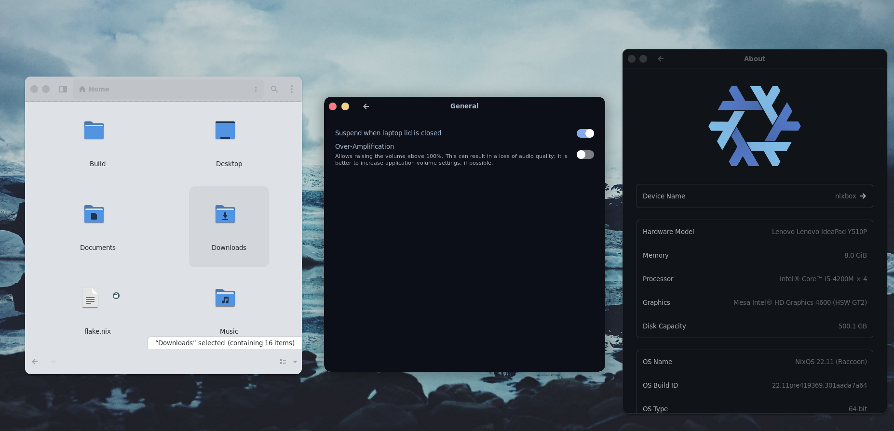

# decay-gtk

* Revamped Decay port to GTK!



# Installation

```sh
git clone --depth=1 https://github.com/decaycs/decay-gtk
cd decay-gtk
mkdir -p ~/.themes
# Put any theme you want from the Themes folder into the created .themes folder
cp -r ./Themes/<theme> ~/.themes
```

# Thanks to

- [AloneER0](https://github.com/AloneER0)

# Info

If you see any inconsistency. Create a issue.
