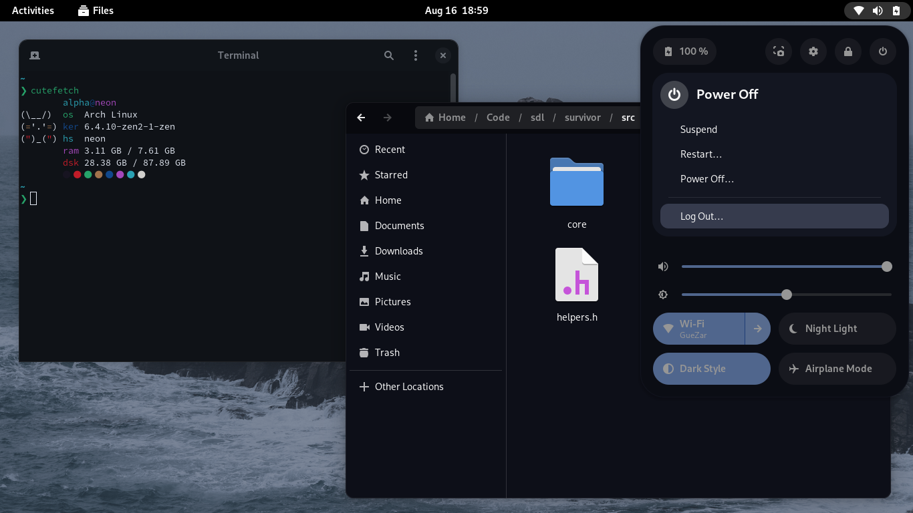

<p align="center">
  
</p>

<h3 align="center">Decay GTK</h3>

# Decay-Gtk

Welcome! This is the revamped decay port to GTK!




## Notes

1. Decay-GTK is migrating to Gradience, which means that if you want
gtk3 applications to be themed, you'll need to install
[adw-gtk3](https://github.com/lassekongo83/adw-gtk3)

2. Actually the whole decay colorscheme is going through a huge
revamp, which also includes its ports, such as this one :)

## Installation

This installation guide covers installing needed packages on an arch linux system
but installation for those packages on others distros can be found quickly
checking at the packages documentation or looking at your package manager available packages.

### Installing required packages

Here's a description about them

- nwg-look or lxappearance: if you're going to try it in a wayland compositor, we recommend
using nwg-look, and lxappearance for xorg environments.
- gradience: allows us to apply the theme in our applications.
- adw-gtk3: Gives legacy support for the theme (gtk3 basically).

You can execute a command such as this:

```sh
yay -S gradience nwg-look adw-gtk3 # replace nwg-look to lxappearance if needed
```

> You can use your AUR helper of preference.

### Getting the presets

```sh
git clone https://github.com/decaycs/decay-gtk && cd decay-gtk
mkdir -pv ~/.config/presets/user && cp -rvf ./Themes/* ~/.config/presets/user
```

#### Note on flatpak users

If you wanna get your flatpak applications themed as well, you will
have to install the adw-gtk3 flatpak & gradience too, and put the templates
at `~/.var/app/com.github.GradienceTeam.Gradience.Devel/config/presets/`
too!

```sh
cp -rvf ./Themes/* ~/.var/app/com.github.GradienceTeam.Gradience.Devel/config/presets
```

### Applying the theme.

Please follow accordingly the next steps.

1. Open `gradience`, you'll see a welcome page, skip, skip, skip, yknow
2. At the overview of gradience, you'll see something similar to this:


3. At the toolbar, press the second icon, it will show a dropbox, Press at `Manage Presets`


4. Inside the gradience presets management popup, you'll see the themes we've installed before
press at the checkmark icon on the theme you wanna apply on your system


5. Then go back to the overview, and press Apply at the top-left corner, you'll see a confirmation like the next one,
turn on the checkboxes accordingly to add gtk3 support too by using adw-gtk3.


6. Now you can close gradience, open `nwg-look` or `lxappearance`, in UI they're pretty similar, so you'll see something
similar to this in both nwg-look and lxappearance:


7. As you can see in the image, you'll have to enable the or `adw-gtk3` or `adw-gtk3-dark` theme, both will
have the decay theme applied in it :)

## Enjoy

We hope you enjoy with decay, please feel free to add a port or something you would want to have
in our organization, you can join our discord to contact us! :)

<a href="https://discord.gg/HaqkpE7B3B">
    
</a>

## Thanks to

- [Alxhr0](https://github.com/Alxhr0)

## Info

If you see any inconsistent when using the theme, please, consider
making an Issue in this repository.
